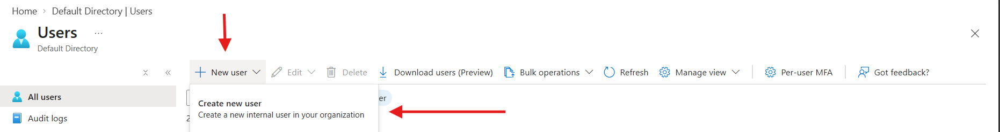
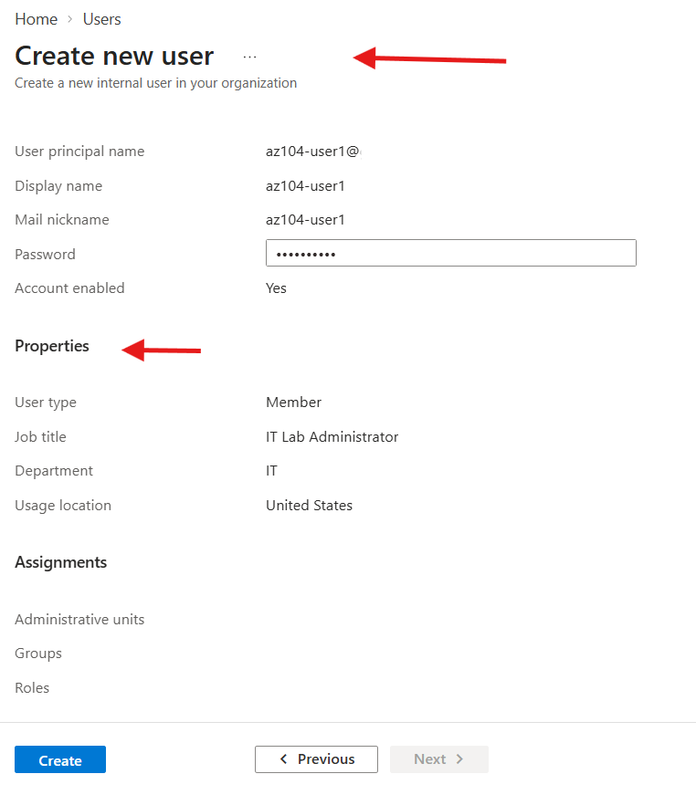
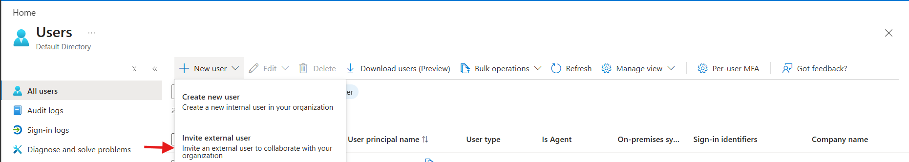
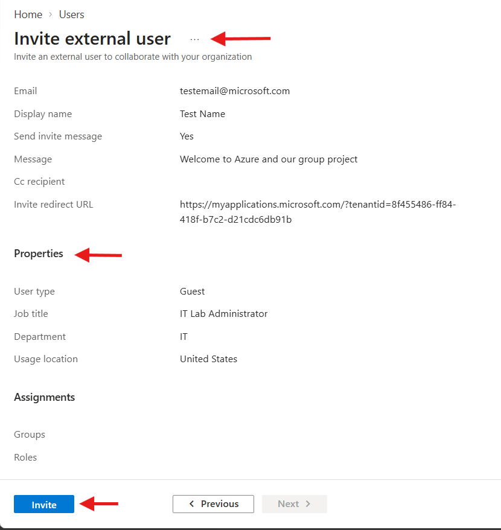
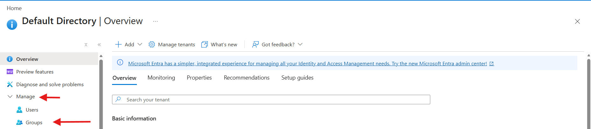
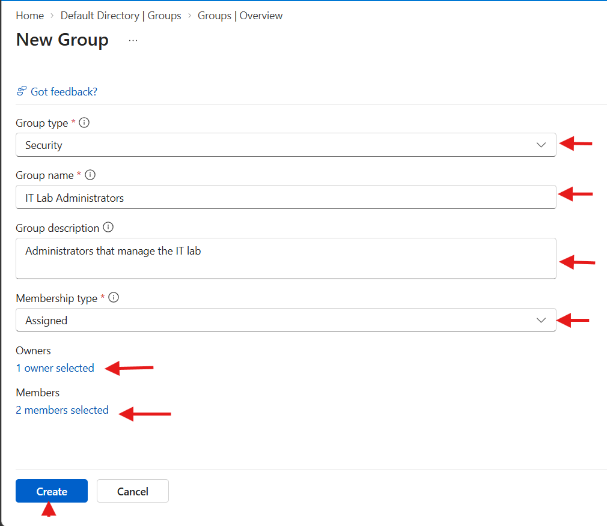
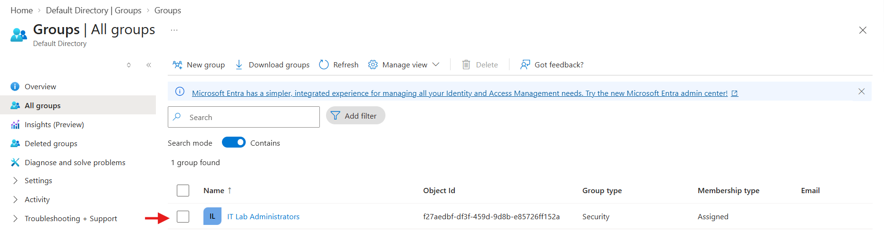

# Lab 01 — Manage Microsoft Entra ID Identities

> **AZ-104 | Microsoft Azure Administrator**

## 📋 Lab Information

| Item | Details |
|---|---|
| Lab | 01 |
| Module | Administer Identity |
| Topic | Microsoft Entra ID identities and groups |
| Estimated Time | 30 minutes |
| Azure Services | Microsoft Entra ID |
| Status | ⬜ Completed |
| Last Practiced | |
| Confidence | ⭐☆☆☆☆ |

## 🎯 Learning Objectives

By completing this lab, I should be able to:

- Create and configure a Microsoft Entra ID user.
- Invite an external user.
- Create a security group.
- Understand assigned/static membership versus dynamic membership.
- Assign an owner and members to a group.
- Explain the difference between internal and external/guest identities.

## 🏗️ Lab Scenario

The official lab uses a pre-production lab environment in which engineers need Microsoft Entra ID identities and groups. Group membership is intended to support administrative organization and, where licensing permits, automatic membership based on user properties. citeturn2search3

## 🧠 What this lab teaches

Microsoft Entra ID provides cloud identity and access capabilities. Users and groups form the foundation of identity administration in this lab. The lab also introduces tenant concepts, external users and group membership models. citeturn2search3

## 🛠️ Prerequisites

- [*] Azure subscription
- [x] Permission to administer Microsoft Entra ID users/groups
- [x] Browser access to Azure portal
- [x] An email address for the external-user invitation

## ⚠️ Official procedure boundary

The **Official Lab Procedure** is maintained by Microsoft and may change as the Azure portal evolves. Follow the current official instructions for the exact portal sequence:

[Microsoft Lab 01 — Manage Microsoft Entra ID Identities](https://microsoftlearning.github.io/AZ-104-MicrosoftAzureAdministrator/Instructions/Labs/LAB_01-Manage_Entra_ID_Identities.html)

This repository deliberately does not replace the Microsoft procedure. It records my practice and learning around it.

---

# Task 1 — Create and configure user accounts

## Objective

Create an internal Microsoft Entra ID user and practice reviewing the user properties available during provisioning.

## Official Procedure

Follow Microsoft's current Lab 01 Task 1.

### Practice checkpoints

- [x] Open Microsoft Entra ID.
- [x] Navigate to Users.
- [x] Create the lab user.
- [x] Review identity and profile properties.
- [x] Review identity and profile properties.
- [x] Confirm the account exists.
- [x] Record the properties that matter to an administrator.


### Lab reference values

The current Microsoft lab uses a user named `az104-user1`, with a job title of `IT Lab Administrator`, department `IT`, enabled account and an auto-generated password. citeturn2search3

## 📸 My Practice






> These image references are  capture screenshots from my own Azure environment.

### What I observed

- 
- 
- 

### What I learned

- 
- 

---

# Task 1b — Invite an external user

## Objective

Practice the workflow for inviting an external identity into the tenant.

## Practice checkpoints

- [ ] Start an external-user invitation.
- [ ] Enter the recipient email address.
- [ ] Add the invitation message.
- [ ] Review profile properties.
- [ ] Send the invitation.
- [ ] Confirm the guest/external account appears.

The current Microsoft lab asks the learner to provide an email address, display name and invitation message, then review basic properties before sending the invitation. citeturn2search3

## 📸 My Practice






# Task 2 — Create groups and add members

## Objective

Create a security group and practice ownership and membership management.

## Official Procedure

Follow Microsoft's current Lab 01 Task 2.

### Practice checkpoints

- [ ] Open Microsoft Entra ID → Groups.
- [ ] Create a Security group.
- [ ] Configure an assigned membership type.
- [ ] Assign myself as owner.
- [ ] Add appropriate members.
- [ ] Verify membership.
- [ ] Review group expiration and naming-policy concepts.

The official lab explains that assigned/static membership is manually maintained, while dynamic membership can update based on user or device properties. Dynamic membership requires the appropriate Microsoft Entra licensing. citeturn2search3

## 📸 My Practice








---


# 🧪 Verification

| Check | Expected result | Result |
|---|---|---|
| User exists | User appears in Users | |
| User properties | Required properties are present | |
| External user | Invitation/account appears | |
| Group exists | Security group appears | |
| Owner | My account is an owner | |
| Members | Expected users are listed | |

---

# 🔧 Commands Used

Record commands only after actually using them.

```bash
# Azure CLI examples to complete during practice
az ad user list --output table
az ad group list --output table
```

### Command notes

| Command | Purpose | Important parameters | Result |
|---|---|---|---|
| `az ad user list` | List Entra users | `--output` | |
| `az ad group list` | List Entra groups | `--output` | |

---

# 🐛 Troubleshooting

| Problem | Cause | Solution | Lesson |
|---|---|---|---|
| | | | |

### Investigation notes

- 
- 

### Resolution

- 

---

# 🧠 AZ-104 Exam Notes

## Remember

- Microsoft Entra ID is the cloud identity and access service used by Azure and Microsoft cloud workloads.
- A tenant is a specific Microsoft Entra ID directory instance.
- Groups can simplify access administration.
- Assigned membership is maintained explicitly.
- Dynamic membership evaluates rules against supported user/device properties and requires appropriate licensing.

## Common Exam Traps

- Do not confuse Microsoft Entra ID roles with Azure RBAC roles.
- Do not assume an external user is the same as an internal member identity.
- Do not assume dynamic group membership is available without the required licensing.

## Important comparison

| Concept | Assigned membership | Dynamic membership |
|---|---|---|
| Membership changes | Administrator/manual | Rule-driven |
| Best for | Stable, explicit groups | Attribute-based organization |
| Maintenance | Manual | Automated after rule evaluation |

## 🎯 AZ-104 Exam Focus

### Know This

User, group, tenant and membership fundamentals.

### Understand This

Why groups reduce administrative overhead and how membership models affect operations.

### Be Able To Do This

Create a user, invite an external user, create a security group and manage membership.

### Watch Out For

Identity administration and Azure resource authorization are related but different layers.

### One-Minute Revision

**Tenant → Users → Groups → Membership → Access.**

---

# 🧠 Muscle Memory Checklist

- [ ] I can explain the purpose of Microsoft Entra ID.
- [ ] I can navigate to Users.
- [ ] I can create a user.
- [ ] I can review user properties.
- [ ] I can invite an external user.
- [ ] I can create a security group.
- [ ] I can assign an owner.
- [ ] I can add members.
- [ ] I can explain assigned versus dynamic membership.
- [ ] I can verify the resulting configuration.
- [ ] I can troubleshoot a failed or incomplete identity workflow.
- [ ] I can reproduce the core workflow without the lab instructions.

---

# 🔁 Repeat the Lab

## First Attempt

Date:

Result:

Confidence:

## Second Attempt

Date:

Result:

Confidence:

## Exam Readiness

⭐☆☆☆☆

---

# 📝 Personal Notes

## What surprised me

-

## What I initially misunderstood

-

## What I can now do from memory

-

## Next repetition target

-

---

# 🏢 Real-World Azure Administrator Perspective

- Prefer groups over assigning access individually where appropriate.
- Keep ownership and administrative responsibilities explicit.
- Treat external identities as a controlled access boundary.
- Document identity lifecycle processes.
- Review licensing requirements before designing dynamic membership.

---

# 🧹 Cleanup

Remove the lab identities and group if they are no longer required.

> ⚠️ Do not delete real production identities. Confirm that the objects belong to this lab before cleanup.

---

# 📚 Official Microsoft Resources

- [Official Lab 01](https://microsoftlearning.github.io/AZ-104-MicrosoftAzureAdministrator/Instructions/Labs/LAB_01-Manage_Entra_ID_Identities.html)
- [Official AZ-104 lab repository](https://github.com/MicrosoftLearning/AZ-104-MicrosoftAzureAdministrator)

# 🏁 Key Takeaways

This lab establishes the identity foundation for the rest of AZ-104: users, groups, tenant concepts, external identities and membership management.
